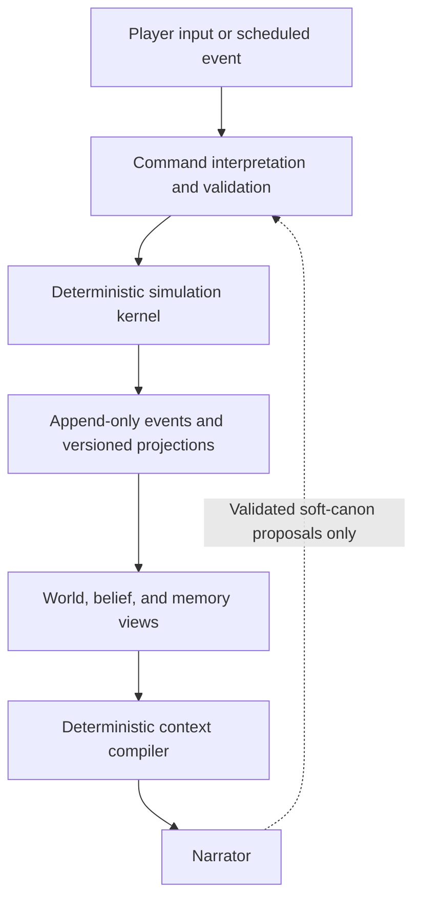

# Successor simulation architecture — plan

Status: **draft — north-star architecture direction**

The original repository analysis was grounded against `main` at commit
`cd7baa280a463d3028640725aded623052a6644c` on 2026-07-16. This revision incorporates
the response in [gpt-sim-design.claude.md](gpt-sim-design.claude.md) and the synthesis in
[world-engine-refactor.gpt.md](world-engine-refactor.gpt.md). It deliberately does not
treat the current session or character-chat model as a framework that must be preserved.
It proposes a successor simulation kernel, a safe bridge from the current narrator-led
lane, and a staged migration path.

This is a north-star architecture, not a promise to implement every subsystem or a
single uninterrupted build queue. Each phase must earn the next through correctness,
player-visible benefit, narrative non-regression, latency, and operating cost.

## Executive decision

Vesper should not become a realistic life simulation by continuing to enlarge
`ChatState`, adding more post-turn extractors, or reviving the old session world model
literally. The recommended direction is to build an authoritative, event-driven
simulation kernel alongside the strong character-chat lane, then migrate chat onto it.

The principal decisions are:

- Keep TypeScript for now. The immediate limits are architecture, persistence,
  concurrency, and scheduling rather than language performance.
- Make code authoritative for time, space, actions, bodies, inventories,
  relationships, knowledge, and consequences.
- Use LLMs only for ambiguous input, consequential high-LOD decisions, sparse drama
  direction, memory compression, and narration.
- Treat RAG as episodic recall and lore retrieval. Never use it as authoritative world
  state.
- Replace aggregate state/writeback with commands, domain events, versioned
  projections, and a durable scheduler.
- Preserve Vesper's strongest existing rule: **LLMs propose; deterministic folds
  dispose.**
- Treat the current character-chat quality as a product asset and a non-regression
  requirement, not merely an implementation detail to be replaced.
- Give players a perspective-safe way to inspect and act on the simulated world; hidden
  causal machinery that cannot be queried is insufficient.
- Use incremental strangler-style migration, measured stop/go gates, and a pre-kernel
  hardening phase instead of a big-bang rewrite.

The target is causal realism: the player can observe consequences, investigate them,
and receive a consistent answer about why they occurred. That produces more believable
life than hundreds of disconnected meters.

## What is already strong

The character-chat lane contains several pieces worth carrying forward:

- The [exchange pipeline](../../character-chat/pipeline.md) has clear stages: lock,
  clock/drift, retrieval, prompt construction, streaming, persistence, and post-turn
  fan-out.
- The former monolithic thirteen-field archivist was split into a pulse plus three
  focused extractors, with per-leg degradation and health telemetry.
- Query embeddings are batched once, facts and episodes use per-query RRF fusion, and
  failures degrade without breaking a reply.
- Prompt instructions are ordered into binding, gate, license, and flavor tiers. This
  is an excellent precursor to a real narrator contract.
- Facts have provenance, retraction on regeneration/edit, pinned memories, and a
  private/perceived/OOC visibility fence. See [memory.md](../../memory.md).
- The older [off-screen simulation proposal](../finished/offscreen-simulation-spec.phase3.md)
  contains good ideas around LOD, perception, affordances, lazy backfill, and
  deterministic fallback.

One documentation warning: placement under `finished/` does not reliably mean a design
was fully implemented. Current code and each document's status header should be treated
as authoritative.

## Current architectural ceiling

### `ChatState` is becoming a world database

The per-character row now holds meters, conditions, relationship state, wardrobe,
presence, whereabouts, memories, loops, drives, trait overlays, milestones, voice
examples, and multiple traces. Most are JSON aggregates, and “another take” relies on a
single pre-exchange snapshot. See
[`chat-state.ts`](../../src/server/engine/chat-state.ts) and the
[`character_chat_state` schema](../../src/server/db/schema.ts).

That is workable for a small conversation aggregate. It will become increasingly unsafe
for a causal world:

- unrelated subsystems contend on one row;
- partial updates and retries become difficult;
- arrays lack independent identity and history;
- explaining why a value changed requires reconstructing overwritten state;
- branching or rolling back more than one exchange becomes impractical;
- concurrent background activity can overwrite foreground progress.

JSONB should remain useful for authored configuration and low-churn extensions.
High-churn authoritative state should be normalized.

### The current off-screen pass is texture, not simulation

The shipped [meanwhile pass](chat-offscreen-life.spec.md) runs after a cumulative story
day, generates the same bounded one-to-three developments regardless of gap length, and
stores whereabouts as prose rather than a location entity. Its specification accurately
calls it bounded texture rather than simulation.

It also writes facts, member state, and scenario folds separately. That eventual
consistency is acceptable for optional narrative texture, but not for authoritative
inventory transfers, travel, money, injury, or commitments. The implementation in
[`chat-meanwhile.ts`](../../src/server/engine/chat-meanwhile.ts) should eventually become
a summarizer of already-resolved events rather than the generator of those events.

### Coordination assumes one process

The [keyed lock](../../src/server/engine/keyed-lock.ts) explicitly says it is correct for
a single-machine deployment and needs a database invariant when scaling. The DB-backed
[job table and runner](../../src/server/engine/jobs.ts) still use an accepted
single-instance in-process runner, although claims are atomic.

A world simulation needs:

- one ordered command stream per world or branch;
- optimistic world/aggregate versions;
- transactional event, projection, and outbox writes;
- durable leases, retries, and idempotency keys;
- distributed job claims;
- explicit recovery after partial failure.

### Schedules and actions are not yet simulation contracts

Schedules currently identify locations and activities with free-form strings. The
[action registry](../../src/contracts/actions/registry.ts) has durations and meter
effects, but only shallow preconditions and regex aliases. See
[`scheduleEntrySchema`](../../src/contracts/world/profile.ts).

A schedule entry must mean “intends to attempt this activity,” not “this definitely
happened.” Eating, washing, working, traveling, and sleeping require access, location,
resources, time, and freedom from interruption.

### Narration currently back-fills too much state

The post-turn extractors infer scene, wardrobe, presence, plans, loops, drives, facts,
and character changes from generated prose. In a real simulation, most of those should
already be known before narration. Otherwise prose is effectively executing game logic
after the fact.

The narrator should render resolved events. It should not silently become the authority
that determines whether an item moved, a promise was kept, a door opened, or someone
learned a secret.

The current lane also demonstrates the opposite failure mode: making movement or
location authority too rigid at the wrong point in a live exchange can damage scene flow
and writing quality. The design problem is therefore not simply “code authority versus
narrator authority.” It is **when authority is applied**. The simulator should frame
facts and possible outcomes before prose, resolve constraints as story events, and gate
irreversible mutations after prose without retroactively invalidating already-streamed
narration.

Several current ratchets deserve immediate fencing during migration. A narrator-derived
drive reveal is sticky, a narrator proposal can mark a plan kept, and fact drafts do not
carry enough truth/belief semantics. These are evidence for an explicit effect contract,
not reasons to make every line of prose mechanically sterile.

## Target architecture



Three distinct layers are essential:

| Layer | Meaning | Storage and retrieval |
| --- | --- | --- |
| World truth | What actually happened and currently exists | Domain events plus relational projections |
| Character belief | What each character perceived, inferred, remembers, falsely believes, or was told | Knowledge ledger and perspective-specific episodes |
| Narrative presentation | What this narrator may state now | Compiled, token-budgeted view with provenance and permissions |

The narrator must never receive belief as unlabeled truth. It also must never receive
secret world truth merely because that truth was semantically relevant.

### Core contracts

The exact fields can evolve, but the architecture needs contracts resembling:

```ts
type SimCommand = {
  id: string;
  worldId: string;
  branchId: string;
  expectedVersion: number;
  actorId: string;
  actionId: string;
  targetIds: string[];
  requestedAt: number;
  args: Record<string, unknown>;
};

type ActionDefinition = {
  id: string;
  preconditions: Predicate[];
  duration: DurationRule;
  resourceCosts: Effect[];
  completionEffects: Effect[];
  interruptionRules: InterruptionRule[];
  observationProfile: ObservationProfile;
};

type DomainEvent = {
  id: string;
  sequence: number;
  worldTime: number;
  type: string;
  actorIds: string[];
  entityIds: string[];
  locationId?: string;
  causationId: string;
  payload: unknown;
};

type ArmedEffect = {
  id: string;
  worldId: string;
  branchId: string;
  sourceCommandId: string;
  kind: EffectKind;
  actorIds: string[];
  targetIds: string[];
  preconditionsVersion: number;
  allowedOutcomes: EffectOutcome[];
  expiresAt?: number;
};

type NarrativeView = {
  mustBeTrue: GroundedFact[];
  perceptibleNow: Percept[];
  beliefsBySpeaker: Belief[];
  recentCausalEvents: DomainEventSummary[];
  recalledEpisodes: Episode[];
  allowedAffordances: string[];
  forbiddenClaims: string[];
  creativeLicenses: CreativeLicense[];
  armedEffects: ArmedEffect[];
};
```

All LLM proposals should use stable entity, action, plan, location, and event IDs. Name
matching and normalized free-text plan matching are too fragile for authoritative
mutation.

### Authority timing and the arm–narrate–confirm contract

Authority has three different moments, and conflating them creates either hallucinated
state or brittle narration:

| Moment | Code responsibility | Narrator responsibility |
| --- | --- | --- |
| Before narration | Derive world conditions, viewpoint, legal affordances, constraints, and the bounded outcomes that may occur | Understand the frame and choose presentation |
| During action resolution | Apply binding constraints and turn impossible or failed actions into resolved in-world outcomes | Narrate success, failure, interruption, uncertainty, or resistance without overriding the result |
| After narration | Confirm only pre-authorized hard effects, append events, and quarantine unsupported claims | Supply structured confirmation or a choice among armed outcomes |

The operational rule is: **derive and arm before; resolve constraints as events; confirm
ratchets after.** “Do not veto during narration” is useful only if it means “do not throw
an infrastructure error or contradict prose after it has streamed.” It must not mean
that impossible actions succeed. A locked door should produce an attempted-entry or
failure event; an absent character cannot answer in person; insufficient travel time can
produce delay or a changed plan.

An `ArmedEffect` is a capability with a narrow scope, version, expiry, and allowed
outcome range. The deterministic kernel creates it after validating preconditions. The
narrator may render or select among those outcomes, and a post-turn fold may confirm one.
An unarmed hard claim remains soft prose, belief, exaggeration, or a proposed event; it
cannot silently change world truth.

This contract should initially fence the most damaging irreversible mutations: secret
disclosures, plan completion or cancellation, travel and presence, inventory transfer,
injury, ownership, relationship milestones, and creation of durable supporting
characters or locations. A plan becoming due may arm an attempt, but only a completion
event can make it kept.

### Persistence and command processing

The recommended authority model is an append-only domain-event journal with snapshots
and normalized projections. This does not require adopting every part of CQRS or storing
all read models forever. It does require every authoritative change to have a durable
cause that can be replayed and audited.

A command should be processed as one transaction:

1. Verify the expected world or aggregate version.
2. Validate actor, targets, location, access, resources, and preconditions.
3. Append one or more domain events.
4. Apply the events to synchronous authoritative projections.
5. Insert outbox work for asynchronous projections, memory, and narration support.
6. Advance the world version.

Retries use the command ID as an idempotency key. One logical sequencer per world or
branch prevents conflicting event order. Background workers can still run concurrently
across worlds.

“Another take” should eventually create or rewind to a branch sequence rather than
restore one opaque snapshot. Branch IDs on commands, events, projections, and memories
make alternate takes explicit and auditable.

## Simulation systems

| System | Code-driven substrate | Appropriate LLM role | Feasibility |
| --- | --- | --- | --- |
| Time and scheduler | Priority queue of appointments, arrivals, expirations, threshold crossings, and deadlines | None | High |
| Space and access | Containment graph, location IDs, links, travel time, locks, capacity, privacy, and transit | Interpret unusual player intent | High |
| Actions and affordances | Preconditions, duration, resource consumption, interruption, effects, and observable traces | Choose among legal actions for high-LOD NPCs | High |
| Body and health | Sleep, reserves, loads, conditions, illness, injury, medication, and temperature | Describe subjective experience | High when abstracted |
| Goals and planning | Needs, goals, commitments, obligations, routines, candidate actions, and utility scoring | Consequential deliberation when choices are close | Medium–high |
| Relationships | Directional trust, attachment, attraction, respect, fear, resentment, obligation, and familiarity | Interpret ambiguous social acts | Medium–high |
| Perception and beliefs | Attention, salience, senses, witnesses, disclosures, lies, rumors, and belief confidence | Extract semantic content of speech | Medium–high |
| Material world | Items, ownership, containers, money, housing, recipes, services, and physical traces | Suggest bounded new content | High for a closed simulation |
| Economy and employment | Wages, shifts, recurring costs, business stock, and district-level supply/demand | Sparse world-pressure proposals | Medium |
| Institutions and norms | Factions, workplaces, schools, law, reputation, permissions, and sanctions | Interpret exceptional cases | Medium |
| Environment | Weather, daylight, temperature, noise, crowding, cleanliness, and hazards | Descriptive rendering | High |
| LOD and off-screen life | Live/active/background/dormant tiers, deterministic catch-up, and promotion | High-LOD choices and event summarization | High |
| Drama control | Tension, opportunities, unresolved conflicts, and pacing budgets | Sparse, non-authoritative director | Medium |

### Time should be event-driven, not tick-driven

Do not simulate every character every minute. Maintain a priority queue of the next
meaningful events:

- action completion;
- travel arrival;
- appointment or commitment due;
- shop opening or shift start;
- condition expiry;
- a body state crossing a decision-relevant threshold;
- a communication being delivered;
- an environmental change.

Continuous values store their last integration time and calculate their current value
analytically when read. During a time skip, drain scheduled events until the target time,
resolve any newly scheduled events, and then snapshot. This preserves causal detail
without paying per-minute cost.

Derived values do not need independent event rows merely because they can be computed.
Once a derived value helps cause durable history—weather closing a route, a need threshold
selecting an action, or a price causing a purchase—the resulting event must capture the
relevant input value and derivation/rule version. Otherwise replay after a formula change
can silently rewrite causality. Fast-forward must also satisfy a partition invariant:
advancing three days once should produce the same authoritative result as advancing one
day three times from the same state and seed.

### Spatial and physical substrate

Locations should form a containment and traversal graph:

- world → region → district → building → room → zone/container;
- links with travel time, access requirements, schedules, and transport modes;
- occupancy, capacity, privacy, visibility, acoustics, and adjacency;
- objects contributing affordances, storage, seating, cover, noise, heat, or services;
- physical traces such as consumed food, moved items, dirty dishes, unlocked doors, and
  damaged objects.

The old movement, travel, proximity, and perception notes contain useful requirements,
but the successor should use stable IDs and event resolution rather than schedule
teleportation or director-authored movement.

### Actions and commitments

An action definition should describe:

- actor, target, and location requirements;
- required affordances, skills, items, access, and proximity;
- duration and whether it can overlap another action;
- resource costs and staged effects;
- interruption and cancellation behavior;
- possible failure modes;
- what witnesses can observe;
- which new events are scheduled.

Plans and promises should be first-class state machines with stable IDs, participants,
deadlines, status, obligations, cancellation rules, and consequences. A plan is not
matched by normalized prose. A schedule may generate an attempt to satisfy a plan, but
only completed events make it kept.

### Cheap background decision-making

Most NPC decisions can use utility AI, GOAP, or behavior trees. Candidate actions come
from current location affordances, needs, goals, commitments, habits, resources, and
social opportunities.

One useful scoring shape is:

```text
utility(action) =
    need relief
  + goal progress
  + obligation
  + habit
  + social opportunity
  - time cost
  - resource cost
  - risk
```

Personality, mood, relationship state, skills, and recent experiences adjust the
weights. A seeded tie-breaker prevents identical NPC behavior while preserving replay.

Invoke an LLM only when the NPC is high-LOD, the decision is consequential, multiple
legal choices have similar utility, or semantic interpretation matters more than numeric
optimization. Even then, provide the top legal candidates and require the model to
select or rank them. Do not let it invent an unrestricted action.

### Material systems and economy

The material layer should include items, quantities, qualities, ownership, containers,
production recipes, services, recurring expenses, wages, and household budgets. This
allows life events to leave evidence: someone who cooked used ingredients and left food
or dishes; someone who worked earned wages; someone who missed work risks a consequence.

Do not simulate every purchase by every dormant NPC. Use layered fidelity:

- exact transactions for live and active entities;
- daily household or business budgets for background entities;
- aggregate district supply, demand, employment, safety, and price indices for dormant
  populations.

These aggregate metrics should be projections from resolved activity rather than values
an LLM moves directly.

### Social and institutional systems

The current regard/familiarity pair is useful but insufficient for a full social world.
Use directional relationship evidence to update a small vector such as:

- trust;
- attachment or warmth;
- attraction;
- respect;
- fear;
- resentment;
- obligation or debt;
- familiarity.

Transient emotion, stable relationship, personality, public reputation, and faction
standing must remain distinct. Institutions then consume the same events through their
own rules: workplaces respond to absence, factions respond to loyalty, households respond
to unpaid obligations, and legal systems respond to witnessed violations.

## Meter and state redesign

Do not make every simulable concept a `0..1` meter. The current
[meter registry](../../src/contracts/meters/registry.ts) combines substrate, drift, UI
bands, and narration prose in one definition.

Use distinct state kinds:

| Kind | Examples | Behavior |
| --- | --- | --- |
| Reserve or stock | energy reserve, satiation, hydration | Depletes or replenishes |
| Load | bladder, intoxication, caffeine, fatigue toxins | Accumulates and clears |
| Derived drive | hunger, thirst, sleepiness, desire for privacy | Computed urgency; never independently stored |
| Phase or cycle | circadian phase, hormonal phase, season | Advances cyclically |
| Condition | injury, illness, hangover, afterglow, embarrassment | Event-created, duration/severity based |
| Resource | money, food, medicine, fuel | Conserved and transferable |
| Capability | skill, strength, mobility, tolerance | Slow-changing constraint |
| Relationship vector | trust, attraction, resentment, obligation | Directional and evidence-backed |
| Commitment | promise, appointment, debt, deadline | Due/kept/missed/cancelled state machine |
| Belief | “Mara is at work,” “Alex lied” | Per-knower, sourced, and confidence-bearing |

The planned clock-keyed meter economy is the right direction, especially separating
energy reserve from circadian pressure. Parts of the
[body-needs draft](../chat-body-needs.plan.md) should change:

- A usual mealtime can modify expectation, habit, and action selection; it should not
  redefine whether a body is physiologically hungry.
- Bladder is naturally a filling load, not a deficit reserve forced through the same
  signed formula.
- Crossing a schedule row must not automatically mean someone ate or washed. It should
  enqueue an attempted activity and resolve access, resources, interruptions, and current
  priorities.
- `promptHint` prose should move out of the physiological definition. A separate
  perception compiler should derive observable cues based on value, clothing, lighting,
  distance, attention, and species.
- Couplings should form an explicit dependency graph so hydration, exertion, heat,
  illness, stress, and sleep cannot become update-order-dependent.

### Body systems worth supporting

A practical but rich body model could include:

- sleep reserve, sleep debt, and circadian pressure;
- satiation, hydration, bladder load, and temperature comfort;
- exertion, soreness, pain, injury, illness, and recovery;
- intoxication, caffeine, medication, and tolerance;
- hygiene and contamination;
- desire and social battery as derived drives rather than compulsory meters;
- configurable hormonal or reproductive phase where appropriate to the character and
  product design.

These systems should exist only when they affect decisions, capabilities, perception,
or observable narration. Exact medical or biochemical simulation is neither necessary
nor credible.

## LLM and narrator responsibilities

The current pulse plus three extraction legs are well-designed for the present chat
architecture. In the successor architecture their responsibilities should narrow.

| Component | Synchronous? | Responsibility |
| --- | --- | --- |
| Input interpreter | Fallback only | Resolve unusual or genuinely ambiguous free-form language after deterministic parsing, entity resolution, and structured affordances |
| NPC deliberator | Rarely | Select among legal high-LOD actions at meaningful decision points |
| World director | No | Propose pressures, complications, or opportunities; never mutate state directly |
| Context compiler | Code, always | Build the narrator's exact perspective-safe view |
| Narrator | Yes | Render resolved state and events without inventing hard effects |
| Memory consolidator | No | Summarize event traces into perspective-specific episodes |
| Soft-canon auditor | No | Extract permitted incidental details and propose them for validation |

An agent is not needed merely to transfer game state to the narrator. Code should do that
through a deterministic context compiler. An LLM may compress a long, low-priority trace,
but hard facts, constraints, knowledge boundaries, and causal events should remain
structured and templated.

The input interpreter should not become a mandatory synchronous hop. Prefer structured
actions, deterministic parsing for common commands, context-aware entity resolution, and
explicit clarification for consequential ambiguity. Use an LLM only when those paths
cannot safely represent the player's intent.

The current binding/gate/license/flavor ordering should become typed `NarrativeView`
sections:

- **Binding:** facts and resolved events the narrator must honor.
- **Gate:** perspective, sensory, agency, and safety constraints.
- **License:** exactly which incidental details may be invented.
- **Flavor:** optional memories, callbacks, and sensory suggestions.

Hard-canon state changes described without a corresponding domain event should be
considered narration errors rather than new truth.

### Soft canon

The narrator still needs creative freedom. Separate incidental or “soft” details from
hard simulation state:

- Soft details may include a fleeting expression, minor room texture, or an unnamed
  background sound.
- They receive an explicit scope and expiry unless promoted.
- A post-turn auditor may propose promotion to a location, item, condition, or fact.
- Promotion uses stable IDs, checks duplication and contradictions, and emits a normal
  domain event.
- Rejected proposals remain prose only and never affect future mechanics.

This preserves expressive narration without letting every colorful sentence mutate the
world.

## Player interrogation and interaction surface

A causal simulation must be visible and interrogable without exposing omniscient debug
state. Build a `PlayerWorldView` from the same projections and permission rules used by
the narrator, scoped to the player character's senses, discoveries, memories, and
beliefs.

A useful surface can include:

- a “now” view of perceived time, weather, location, nearby entities, and salient body
  sensations;
- a known calendar of commitments and expected travel;
- a discovered map rather than a complete world graph;
- inspect, travel, use, ask, wait, and plan affordances;
- a perspective-safe “what changed while I was away?” recap;
- causal explanations when the character could reasonably know them.

Raw numeric meters are optional. The important property is that simulated state changes
what the player can notice, ask, attempt, and understand. The same command contracts
should support prose input and explicit UI actions so the interface does not create a
second rules engine.

Player queryability is an acceptance criterion. If a system changes hidden state but
cannot influence action, perception, explanation, or consequences, it is probably
unnecessary simulation or premature fidelity.

## Memory and RAG assessment

Vesper's current RAG is competent for conversational recall:

- per-query embeddings;
- RRF fusion;
- relevance floors;
- pinned facts;
- source-message retraction;
- retrieval provenance;
- a perceived/private/OOC visibility fence.

Those shipped improvements are recorded at the top of
[RAG-improvements.plan.md](../RAG-improvements.plan.md).

It is not yet suitable as the knowledge architecture of a simulated world:

- `witnessedBy` is written but not consumed as a retrieval permission.
- `canon` is effectively always true and has no working belief/lie producer.
- Narrator-facing `FactHit` drops `subjectId`, witnesses, canon, and temporal validity.
  See [`facts.ts`](../../src/server/memory/facts.ts).
- Facts lack normalized object identity and valid-time intervals.
- Episodes are primarily summary, turn number, threads, witness set, and source message;
  they lack actors, location, event type, salience, affect, and causal references. See
  [`episodes.ts`](../../src/server/memory/episodes.ts).
- Retrieval cannot distinguish “true now,” “was true then,” “Alice believes,” and “Bob
  falsely told Alice.”
- Flat recent windows and prose summaries still carry substantial continuity burden.

### Recommended memory stack

1. **World projections:** exact SQL queries for current authoritative state.
2. **Domain event log:** authoritative history and causality.
3. **Knowledge ledger:** one assertion can have many knowers, sources, confidence levels,
   and belief states.
4. **Perspective episodes:** summaries grounded in observation events, with
   entity/time/location metadata.
5. **Vector recall:** semantic retrieval only within already-eligible perspective and
   temporal scopes.
6. **Authored lore:** structured tags/unlocks plus vector retrieval.

A belief record should minimally carry:

- knower ID;
- assertion or proposition ID;
- subject, predicate, and object/value;
- learned time and source event/person;
- valid-from and valid-to world time;
- confidence;
- believed-truth status;
- contradiction and supersession links.

Retrieval should combine semantic similarity with structured factors such as recency,
salience, unresolved relevance, relationship relevance, current entities, location, and
temporal validity. Add lexical/full-text retrieval for names, quoted phrases, and exact
commitments.

Postgres plus pgvector remains a reasonable foundation. If HNSW or IVFFlat is introduced
at larger scale, remember that pgvector applies filters after approximate index scanning
unless iterative scanning or an appropriate partition/index strategy is used. Per-world
and per-knower filters therefore affect recall design. The official pgvector guidance
also recommends hybrid full-text/vector retrieval and supports RRF:
[pgvector filtering and hybrid search](https://github.com/pgvector/pgvector#filtering).

### Retrieval evaluation

Expand the existing harness beyond semantic relevance to test:

- perspective leakage;
- secret/non-witness exclusion;
- stale-belief retrieval;
- temporal ordering;
- causal predecessor recall;
- duplicate-name identity;
- contradiction and supersedence;
- exact commitment retrieval;
- narrator grounding violations;
- retrieval latency and token cost.

## TypeScript decision

TypeScript is sufficient for the foreseeable implementation.

TypeScript is a static type system over JavaScript, and its type-specific syntax is
erased before execution. Runtime performance is fundamentally V8/Node performance rather
than “TypeScript performance.” See the
[TypeScript handbook](https://www.typescriptlang.org/docs/handbook/intro.html).

Vesper's likely workload is primarily:

- PostgreSQL access;
- network-bound LLM and embedding calls;
- event scheduling;
- sparse graph traversal;
- deterministic reducers;
- prompt and context assembly.

TypeScript is entirely reasonable for this. Node worker threads are available for
CPU-intensive JavaScript, although they provide little benefit for I/O-heavy work:
[Node worker-thread documentation](https://nodejs.org/api/worker_threads.html).

Recommended language strategy:

- keep the web/API/orchestration layer in TypeScript;
- extract a pure `simulation-kernel` package with no Next.js or database imports;
- use integer story time, fixed-point currency/resources, seeded PRNG, and deterministic
  event ordering;
- benchmark replay, fast-forward, pathfinding, and population planning separately;
- design serialized command/event contracts so the kernel can later move behind a
  language-neutral boundary.

Consider Rust only if profiling shows sustained CPU pressure from:

- very large pathfinding or spatial queries;
- constraint solving across large populations;
- bulk multi-year fast-forward;
- economic simulation;
- Monte Carlo planning;
- replaying millions of events.

If that happens, port the hot pure kernel or one subsystem to Rust, WASM, or a sidecar. A
full rewrite now would preserve the current architectural bottlenecks in a faster
language.

## Feasible and infeasible scope

### Highly feasible in deterministic code

- story clocks, calendars, appointments, travel, access, and opening hours;
- body needs, sleep, conditions, medication, clothing, and temperature;
- inventory, ownership, money, wages, bills, and household budgets;
- actions with durations, costs, effects, interruption, and traces;
- commitments and consequences;
- directional relationships and reputation;
- perception, witnesses, disclosure, secrets, and rumor transmission;
- LOD promotion/demotion and deterministic catch-up;
- weather, daylight, crowds, privacy, and location affordances.

### Feasible as hybrid systems

- nuanced NPC choice;
- interpretation of social tone and implied meaning;
- lies and conversational disclosures;
- unusual player actions;
- sparse off-screen developments;
- dynamic supporting characters and locations;
- drama pacing and complication generation.

Code should constrain these; LLMs should resolve semantic ambiguity within those
constraints.

### Infeasible or counterproductive goals

- an LLM thought process for every NPC every minute;
- continuous high-fidelity physiology or physics;
- a perfectly realistic macroeconomy built from individual NPC transactions;
- exact human psychology;
- unrestricted agent invention of locations, items, history, and causal effects;
- reconstructing world truth from narration and vector memory;
- simulating dormant entities merely so their counters continue moving.

“As much of the world as possible” should mean broad causal coverage at different levels
of detail, not equal fidelity everywhere.

## Observability and engineering metrics

The simulation should expose metrics beyond character meters:

- command acceptance and rejection reasons;
- event throughput and scheduler queue depth;
- replay hash divergence and invariant failures;
- projection lag and outbox retry counts;
- LOD population per tier and promotion/eviction reasons;
- LLM calls per exchange and per story day;
- synchronous and settlement call fan-out, timeout rates, and degraded-leg frequency;
- LLM proposal acceptance, repair, and rejection rates;
- narrator grounding violations;
- perspective-leakage failures;
- context token composition and source coverage;
- p50/p95 narrator, retrieval, command, and fast-forward latency;
- aggregate world projections such as employment, scarcity, safety, faction influence,
  illness prevalence, and housing pressure.

Every event should expose its causation chain in developer tools. “Why did she leave?”
should be answerable as structured evidence: need threshold → chosen action → travel
event → arrival, not an opaque sentence generated yesterday.

## Product and narrative-quality evaluation

Correctness tests are necessary but not sufficient. Every meaningful slice should be
evaluated on four axes:

| Axis | Questions and measurements |
| --- | --- |
| Simulation correctness | Do invariants hold? Is replay deterministic? Does one three-day skip match three one-day skips? Can every hard change be explained? |
| Narrative quality | Does character voice, romantic tension, emotional continuity, pacing, and prose quality match or exceed the current lane? |
| Player-visible value | Can blinded evaluators or players detect greater continuity and aliveness? Do world facts alter choices, affordances, and consequences rather than merely add exposition? |
| Operational cost | What happens to p50/p95 latency, token usage, model-call fan-out, failure recovery, and cost per exchange or story day? |

Maintain a versioned baseline corpus of representative conversations and scenario
replays. Run blind transcript comparisons and targeted ablations in which one world read
or subsystem is removed. Evaluate contradiction rate, character fidelity, romance
quality, causal enactment, detectability, and grounding—not only whether a fact was
mentioned.

Feature experiments must exercise causality. A weather-only prose comparison measures
texture; a useful weather slice changes travel, clothing, plans, availability, comfort,
or resource use and then tests whether those effects are enacted coherently. If a
correct subsystem produces no reliable player-visible improvement, stop expanding it
until the interaction or narration surface is fixed.

## Migration sequence

The phases below describe a north-star sequence, not a calendar promise. Size each phase,
set an operating budget, and define exit criteria before starting it. Prefer adapters and
strangler migration over a flag day. Do not proceed merely because the previous phase
shipped.

### Phase 0 — current-lane safety and evidence

- Freeze a representative baseline of transcripts, scenario inputs, latency, token
  usage, settlement fan-out, and failure behavior.
- Fence current hard ratchets such as drive revelation, plan resolution, movement,
  presence, inventory transfer, ownership, and durable canon.
- Add explicit truth-versus-belief read policies and viewpoint-aware witness handling.
- Assert single-machine operation or implement database-level per-session ordering before
  relying on the job runner across machines.
- Pilot one causal world-read experiment and one perspective-safe player query surface.
- Proceed to kernel work only with defined correctness, narrative-quality, latency, and
  player-value criteria.

This phase should primarily remove unsafe authority and establish evidence. It should
not add more post-turn agents or pretend that patches to aggregate state are the final
world architecture.

### Phase 1 — simulation foundation

- Introduce world and branch IDs, versions, commands, domain events, snapshots, seeded
  randomness, and replay tests.
- Add an authoritative event table distinct from observability telemetry.
- Implement transactional projection and outbox writes.
- Keep existing chat behavior through an adapter.

### Phase 2 — time, action, and space

- Replace location names with stable IDs.
- Build containment, links, access, travel, occupancy, proximity, and privacy.
- Introduce action preconditions, effects, interruption, failure, and observation
  profiles.
- Make schedules planned attempts rather than automatic facts.
- Move clock advancement and time skips through the event scheduler.

### Phase 3 — knowledge and narration

- Add observation events and the knower/belief ledger.
- Build `NarrativeView` and the deterministic context compiler.
- Restrict RAG to eligible perspective-specific memories.
- Make the narrator render resolved events and quarantine soft canon.

### Phase 4 — life substrate

- Add typed reserves, loads, conditions, needs, inventories, recurring obligations,
  jobs, housing, and relationship vectors.
- Replace exchange-keyed drift and automatic rhythm satisfaction.
- Implement households, wages, recurring costs, and material traces.

### Phase 5 — LOD and autonomous life

- Implement utility-driven background behavior and lazy catch-up.
- Invoke LLM deliberation only for promoted characters at decision points.
- Convert the meanwhile agent into a summary/drama layer over resolved events.
- Add tier transitions, event validation, and off-screen debugging views.

### Phase 6 — institutions and macro systems

- Add factions, businesses, law, reputation, production, district markets, illness
  spread, environment, and longer life-course change.
- Keep macro behavior aggregate until an entity is promoted to a higher LOD.

## Vertical-slice acceptance test

Before broadening the world, build one demanding slice:

> Fast-forward one household, one workplace, several locations, and roughly a dozen
> connected characters through seven story days. They must sleep, eat, commute, spend
> resources, keep or miss commitments, exchange information, leave physical traces, and
> retain different beliefs. Replay with the same seed must produce the same authoritative
> events. The narrator must expose only what the current viewpoint can perceive or know.

The slice should meet these conditions:

- no per-NPC-per-tick LLM calls;
- normally only the narrator is on the synchronous model path;
- deterministic parsing and structured affordances handle common input; an LLM input
  interpreter is a fallback for genuinely ambiguous free-form commands;
- high-LOD deliberation is event-triggered and bounded to legal candidate actions;
- background and dormant behavior remains deterministic;
- a seven-day skip is substantially cheaper than simulating every minute;
- every important change can be traced to a command or scheduled event;
- impossible actions resolve as narratable failure, interruption, or constraint events
  rather than infrastructure errors or retroactive prose rejection;
- no narrator statement can silently transfer an item, move a character, resolve a plan,
  or disclose a secret;
- the player can inspect the perceived current world, act through its affordances, and
  understand important consequences without receiving omniscient truth;
- blind transcript and scenario evaluation shows narrative non-regression and a
  detectable increase in causal continuity or aliveness;
- latency, model-call fan-out, and cost remain inside a predeclared budget.

If this slice works, the architecture is ready to become intricate. If it does not,
adding more meters will only make failures harder to diagnose.

## Final recommendation

Do not merge the old session world model back into character chat and do not add a large
batch of new meters to the existing state row. Extract its strongest concepts—spatial
graphs, perception, LOD, affordances, travel, and deterministic validation—into a new
simulation kernel.

Keep the current chat lane as the narrative-quality benchmark. The successor succeeds
when it can produce the same or better character writing while giving that writing a
replayable, perspective-safe, materially causal world underneath it.

## Recommendations not adopted unchanged

The supplemental review proposes several valuable near-term corrections. They should
inform the design, but adopting their simplest form would leave important semantic or
product gaps. This section records each proposal, what it lacks, and the recommended
form.

### “Never veto during narration”

**What it is:** Avoid letting deterministic movement, location, or action gates interrupt
a live scene or invalidate prose after the narrator has committed to it. This responds
to the project's earlier experience with rigid location authority harming conversation
quality.

**What it lacks:** Taken literally, the rule makes physical and institutional
preconditions advisory. Locked doors, absence, travel time, missing resources, capacity,
and permissions would cease to be causal if the narrator could simply carry the action
through.

**Recommendation:** Never produce a protocol-level veto after prose has streamed.
Instead, validate and arm outcomes before narration and represent constraints as
resolved story events: failure, resistance, delay, interruption, substitution, or a
changed plan. Constraints remain binding; the result remains narratable.

### Add `canon` to fact drafts and gate reads on it

**What it is:** Allow fact extraction to mark a draft non-canonical and prevent
non-canonical rows from being retrieved as world truth. This is a worthwhile immediate
safety fence because the current draft schema cannot express the distinction.

**What it lacks:** “Not world truth” does not mean “irrelevant.” A lie, rumor, mistaken
inference, dream, or outdated observation may be false while remaining an authentic and
important character belief. A Boolean also cannot express uncertainty, temporal
validity, contradiction, or who holds the belief.

**Recommendation:** Add the field and truth-channel read fence during Phase 0, but do not
treat that as the final knowledge model. Separate propositions/world assertions from
per-knower belief records carrying source, confidence, learned time, valid time,
contradictions, and supersession. Non-canon content may enter a belief view only through
a disclosure, observation, inference, or authored-memory event.

### Consume `witnessedBy` as a retrieval filter

**What it is:** Stop returning a memory to a character who did not witness its source
event. This closes an obvious perspective-leak path in the current RAG lane.

**What it lacks:** Witnessing is only one way to know. Characters can be told, infer,
misremember, read, overhear, or forget. A flat witness filter also does not distinguish
the player, a speaking character, the narrator, a world director, or an administrative
debug view.

**Recommendation:** Apply an immediate viewpoint-aware witness fence where the current
data supports it, then replace the Boolean/set interpretation with observation and
disclosure events plus a knower-scoped eligibility policy. Retrieval must first select
the requesting viewpoint and knowledge channel, then apply semantic ranking inside the
eligible set.

### Mark a plan kept only after its target time

**What it is:** Prevent narration from marking a future plan complete before the planned
time arrives.

**What it lacks:** Reaching or passing the target time proves only that a plan is due or
overdue. It does not prove that participants arrived, the activity occurred, resources
were available, or the commitment was fulfilled.

**Recommendation:** Use the clock to schedule an attempt and transition the plan to due.
Only a resolved completion event may mark it kept. Explicit cancellation, interruption,
failure, lateness, and no-show events should drive their own states and consequences.

### Use an ambient-weather transcript comparison to justify the kernel

**What it is:** Add a cheap deterministic world read such as weather, run conversations
with and without it, and test whether the narration uses the information.

**What it lacks:** This primarily measures prose texture and prompt enactment. A result
can be noticeable without proving causal simulation, or unnoticeable because the
narration/interaction surface is weak rather than because a kernel has no value.

**Recommendation:** Use ambient weather as a pipeline smoke test, not an architectural
referendum. The decision experiment should exercise a small causal chain: weather alters
travel, clothing, comfort, availability, a plan, or resource use; the player can inspect
or react to it; later consequences remain consistent. Pair transcript ablation with
state and action assertions.

### Treat the cheap middle path as an alternative to the kernel

**What it is:** First fix reveal gates, plan timing, canon handling, witness retrieval,
and ambient context using existing tables and agents. This is an attractive way to gain
safety and evidence with limited implementation cost.

**What it lacks:** Those patches cannot provide shared multi-character worlds, stable
object and location identity, mapped space, conserved inventories, player physiology,
ordered cross-character causality, or replayable material consequences. Testing only
ambient flavor may also understate the value of a kernel designed for causal
interaction.

**Recommendation:** Adopt this work as Phase 0 and as a regression baseline, not as the
terminal architecture. Use it to remove unsafe narrator authority, measure the current
lane, and validate the context path. Whether an individual experiment succeeds should
change subsystem priority and presentation design, not erase requirements that aggregate
chat state cannot satisfy.

