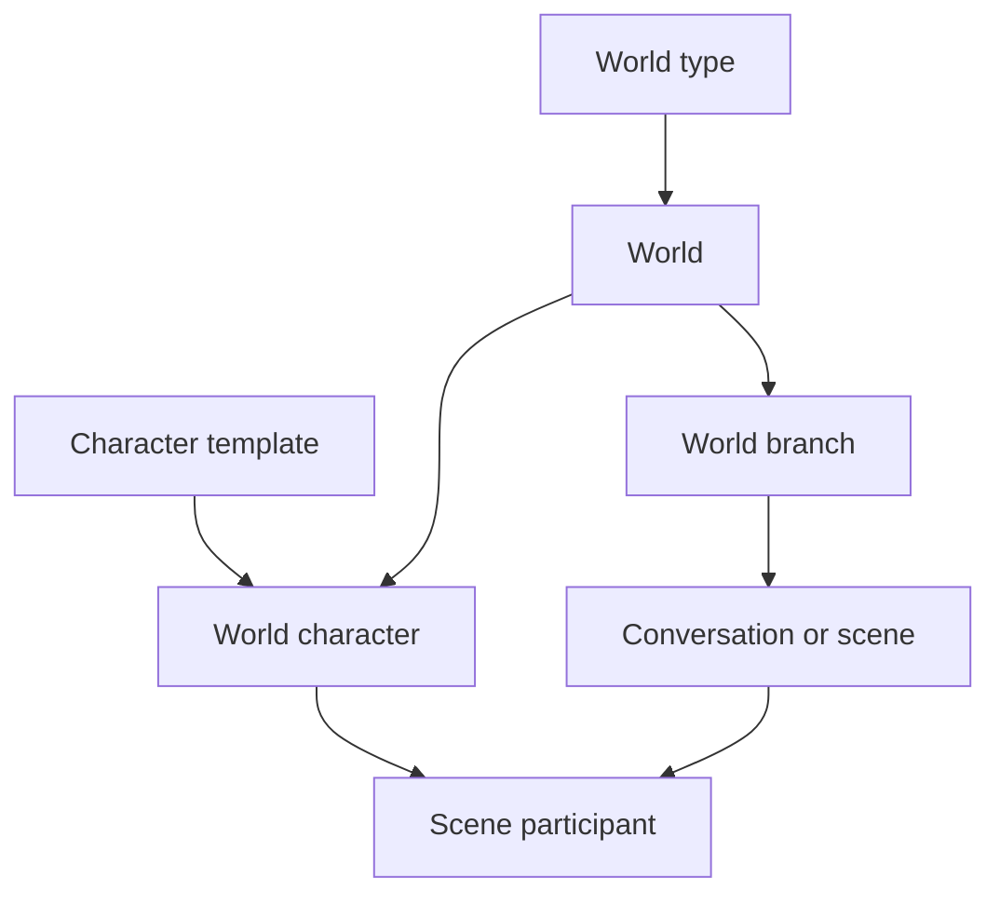

# World engine refactor — GPT supplemental review

Status: **supplemental architecture review**

Companion to [world-engine-refactor.plan.md](world-engine-refactor.plan.md) and
[gpt-sim-design.plan.md](gpt-sim-design.plan.md). This document does not replace either
plan. It identifies where the two analyses reinforce one another, where they imply
different architectures, and which additional decisions follow from reading them
together—especially in light of the owner answers embedded in the open questions of the
Claude plan.

## Executive synthesis

The plans agree on most of the product philosophy:

- the successor is character chat generalized into a world, not a resurrection of the
  deprecated session lane;
- story time, not wall time, remains authoritative;
- deterministic code should do nearly all routine simulation;
- LLM calls must be rationed and should propose rather than directly mutate canon;
- physiological substrate should be separated from what a narrator can perceive;
- LOD is necessary as the roster and world grow;
- the current aggregate state and agent fan-out cannot simply grow without bound.

Claude's plan is strongest as a locally grounded feature catalog and latency/call-budget
analysis. It correctly finds several high-value seams already latent in the code:

- the substrate/read split;
- the need for a salience bus;
- a composed `SceneFrame`;
- the cost hidden inside the settle lock;
- schedule activity kinds;
- cheap, deterministic environment derivation;
- LOD for roster-sized post-turn fan-out.

The GPT plan is stronger on authoritative state, causality, identity, concurrency,
perspective, and long-run extensibility:

- commands and stable IDs;
- domain events and versioned projections;
- an event scheduler rather than a world tick;
- world truth distinct from character belief and narration;
- a deterministic narrator context compiler;
- normalized high-churn state;
- durable jobs, replay, branching, and idempotency;
- structured knowledge before vector retrieval.

The central tension is Claude's thesis **“derive the world, remember the people.”** It is
excellent when applied to exogenous, path-independent phenomena. It becomes incorrect
when it is applied to actual movement, item state, access, resource use, schedules,
illness onset, relationships, or any other result that depends on what happened.

The reconciled thesis should be:

> **Derive exogenous fields. Schedule possible changes. Record what actually happens.
> Project current world state. Remember each character's perspective. Narrate only from
> an allowed view.**

This is not a return to per-minute ticking. The missing middle is an event-driven world
kernel.

## Comparison at a glance

| Concern | Claude plan | GPT plan | Reconciled direction |
| --- | --- | --- | --- |
| World evolution | Derive from authored data, seed, and clock; remember history | Commands, events, scheduler, projections | Derive only path-independent inputs; event-source path-dependent outcomes |
| Time | Lazy formulas and skip folds | Priority queue and analytical integration | Analytical values plus scheduled threshold/action events; no fixed tick |
| Space | Inert place properties; reject movement authority | Containment/travel/access graph with authoritative events | Lightweight authoritative spatial graph; no continuous geometry or narrator-blocking traversal |
| Schedules | Rhythm slots can credit off-screen care | Schedule is intention, not proof | Slots enqueue activity attempts; actions resolve access, resources, conflicts, and completion |
| LOD | Primarily ration post-turn settle calls | Ration both simulation fidelity and LLM attention | Two independent LOD policies sharing one relevance model |
| Agents | Add no new legs; extend current calls | Narrow current extractors; add sparse semantic/deliberation jobs when justified | No new fixed per-turn legs; allow event-triggered jobs and an optional bounded input interpreter |
| Narrator | Existing pipeline remains central | Narrator renders pre-resolved events through `NarrativeView` | Formalize current digest tiers as a typed context contract; narrator never creates hard effects |
| Memory | Facts/episodes/meanwhile are history | World truth, belief ledger, episodes, then RAG | Facts and episodes become perspective projections of events, not the authority |
| State | Extend current seams, then redesign meter classes | Normalize high-churn state and add event journal | Ship tactical adapters, but establish the new authority boundary before broad feature growth |
| Economy | Prefer authored `means`; park transaction ledger | Exact active transactions plus aggregate background economy | Start with `means`, but build a generic resource-transfer substrate so later fidelity is possible |

## Correcting the pure-derivation boundary

The Claude plan groups several things together as pure functions of authored data, seed,
and clock. Some are genuinely pure. Others contain path-dependent state and must be split
into a derived component and a historical component.

| Concept | Purely derived part | Historical or event-sourced part |
| --- | --- | --- |
| Season, lunar phase, birthday occurrence | Calendar function | How a character celebrated, whether somebody remembered, resulting feelings |
| Daylight | Calendar, latitude, and clock | Broken lights, closed blinds, fires, power loss, witnessed visibility |
| Weather | Seeded baseline or forecast field | Storm damage, wet clothing, cancelled travel, fires, player/world interventions |
| Ambient temperature | Baseline climate + time + place envelope | Heating state, open windows, damaged shelter, body thermal state |
| Circadian pressure | Biological phase function | Actual sleep reserve and sleep debt |
| Appetite rhythm | Habit and mealtime expectation | Actual intake, illness, exertion, and current satiation |
| Work routine | Authored intended schedule | Whether the character traveled, arrived, worked, left, or missed the shift |
| Illness risk | Hazard rate derived from conditions | The illness-onset event and its actual course |
| Whereabouts expectation | Routine inference | Actual departure, travel, arrival, and observation events |

Two rules follow.

### A derived value that causes history must be captured

Pure derivation is replayable only while the derivation algorithm, seed, authored inputs,
and calendar semantics remain identical. If a derived value causes an authoritative
effect, the event should capture the causal value and derivation version.

For example, an outdoor-plan cancellation event should record that the weather read was
`heavy_rain` under `weather-v2`, rather than expecting a future replay under
`weather-v5` to regenerate exactly the same band.

Recommended fields:

```ts
type DerivedEvidence = {
  kind: string;
  value: unknown;
  derivationId: string;
  derivationVersion: number;
  seedScope: string;
  evaluatedAt: number;
};
```

### Skip partitioning must not change outcomes

Seeding a roll from “the clock at the end of this skip” is deterministic but not
necessarily invariant. One three-day skip and three one-day skips can produce different
illness, encounter, or interruption outcomes.

Scheduled stochastic events should use a stable hazard process or stable interval/event
keys. Property tests should require:

```text
advance(t0 → t3) == advance(t0 → t1 → t2 → t3)
```

for authoritative state and event identity, aside from explicitly presentation-only
summaries.

## No world tick does not mean no scheduler

Claude correctly rejects a universal world tick. The replacement is not read-time
derivation alone; it is a priority queue of meaningful events.

The scheduler should hold things such as:

- action completion and interruption checks;
- departures and arrivals;
- appointments, shifts, deadlines, and birthdays;
- condition transitions and expirations;
- messages in transit;
- resource replenishment or recurring expenses;
- a physiological state crossing an action-relevant threshold;
- weather or institutional events that have been materialized because something depends
  on them.

Continuous components can still integrate analytically. The scheduler exists only for
points at which the world may make a different decision or emit a durable consequence.

During a time skip:

1. Read the next scheduled event.
2. Integrate affected analytical state to that event's time.
3. Validate and resolve the event against current projections.
4. Append resulting domain events.
5. Schedule any follow-up events.
6. Continue until the requested target time.

This produces the composability Claude wants without pretending that actual history is a
clock function.

## Owner answers imply a concrete identity model

The owner annotations settle several previously open questions:

- there will be many worlds;
- locations return, including furniture, ownership/inhabitants, routines, mappings, and
  guarded procedural generation;
- realism has no fixed feature ceiling, but systems should be ordered by usefulness and
  permit sensible deferral or “sway”;
- the player has a simulated body governed by most NPC physical rules;
- `desire` should be scheduled;
- aggregate state and overlay composition likely need redesign.

These answers make `(chatId)` the wrong long-term owner of mutable life state.

### Recommended entity hierarchy



| Entity | Owns |
| --- | --- |
| `WorldType` | Compatible species/content schemas, default mechanics, calendars, climate families, action packs, optional economy/health modules |
| `World` | Lore, seed, authored locations, instantiated characters, rule configuration, current canonical branch |
| `WorldBranch` | Story clock, event sequence, projections, alternate-take lineage |
| `CharacterTemplate` | Reusable authored identity, body template, voice, personality, compatibility declarations; no mutable world life |
| `WorldCharacter` | Instantiated body, location, inventory, relationships, beliefs, memories, schedules, and conditions in one world/branch |
| `Conversation` or `Scene` | Transcript, presentation preferences, scene-local state, participant references; not the owner of bodies or the world clock |
| `PlayerCharacter` | A world entity using shared physical/action systems, controlled by the player rather than an NPC decision policy |

This composes the owner's three possibilities rather than choosing only one:

- characters remain reusable templates;
- worlds carry distinct lore and optional mechanics while sharing a core kernel;
- a template can declare compatible world types, and instantiation validates or adapts
  it into a `WorldCharacter`.

Existing chats can migrate by creating a private world and one world-character instance
per participant. “Fresh start/AU” should create a new world or branch rather than merely a
new memory island. Shared-history conversations should point at the same world-character
instances.

## Authoritative space should return, but in a lighter form

Claude's D.1–D.4 place properties are strong. D.6's permanent rejection of travel and
movement authority no longer fits the owner's answer or the wider simulation goal.

The previous movement implementation failed because schedule movement was late or
teleporting and narration depended on that state. It does not follow that authoritative
location is inherently wrong.

The replacement should be a lightweight spatial model:

- containment: world → region → district → parcel/building → room → zone/container;
- sparse connections rather than precise geometry;
- connection duration, access rules, transport mode, opening hours, and hazards;
- occupancy and capacity;
- privacy, light, noise, shelter, temperature envelope, and perception channels;
- ownership, residence, employment, and routine links;
- furniture and items contributing affordances;
- `departed`, `travel_interrupted`, and `arrived` events.

Most travel can be one scheduled interval, not pathfinding through every sidewalk. A
route planner may choose among a few links; only live or highly consequential travel
needs interruption detail. The narrator never waits for a movement agent—the kernel
already knows whether departure or arrival occurred.

### Procedural-location guardrails

Procedural generation should propose location definitions, never write arbitrary canon
directly. A proposal should require:

- a stable parent location;
- purpose and type from a world-type vocabulary;
- a canonical normalized name and alias set;
- a reason the location is needed by a plan, resident, job, service, or player action;
- non-duplication against name, purpose, owner, coordinates/parent, and embedding
  similarity;
- reachability from at least one existing node;
- bounded counts by type and region;
- required affordances and missing-resource checks;
- a deterministic idempotency key;
- provenance and an audit trail.

Useful lifecycle states are `provisional`, `canonized`, `merged`, and `retired`.
Provisional locations can support a proposed future scene without polluting general
retrieval. They become canon when visited, explicitly authored, or referenced by an
authoritative event. Duplicate proposals merge into an existing location rather than
creating “Café”, “The Café”, and “Cafe Downtown” as separate places.

## Schedules are intentions, not completed history

Both plans identify `ScheduleEntry.activity.kind` as an important unlock. The supplemental
qualification is that a schedule row must not directly feed, wash, dress, move, or pay a
character.

A schedule crossing should create an activity candidate:

```ts
type ScheduledIntent = {
  characterId: string;
  activityKind: string;
  preferredLocationId?: string;
  windowStart: number;
  windowEnd: number;
  priority: number;
  flexibility: number;
  requiredAffordances: string[];
};
```

Resolution then checks:

- whether the character is available;
- whether travel is possible;
- whether the location is open and accessible;
- whether required items or money exist;
- whether a higher-priority commitment or emergency displaced it;
- whether the action started, completed, was shortened, or was missed.

This distinction is essential for emergence. A missed meal, late shift, occupied
bathroom, cancelled train, or lack of groceries becomes an actual cause rather than being
silently laundered away by `rhythmBodyPatch`.

Routine remains valuable as a low-cost prior and a dormant-LOD summary. It simply is not
proof of completion.

## LOD has two separate jobs

Claude's insight that roster growth makes the settle a scaling problem is correct. The
GPT plan's use of LOD for world simulation is also necessary. A large event-driven world
does not pay a per-minute tick, but it can still generate too many appointments,
transactions, social encounters, and projections.

Use two policies:

### Simulation LOD

Controls how much causal detail is resolved.

| Tier | Simulation behavior |
| --- | --- |
| Live | Exact actions, locations, resources, perceptions, and interruptions |
| Active | Exact important events; routine intervals may be compressed |
| Background | Daily/shift/household aggregates with deterministic exception events |
| Dormant | No ongoing event queue; lazily materialize from last checkpoint and durable obligations |

### Inference and narrative LOD

Controls model calls, prompt weight, extraction, and UI attention.

| Tier | LLM/prompt behavior |
| --- | --- |
| Engaged | Full narrator context and relevant character analysis |
| Present but quiet | Compact state, deterministic pulse where possible, no redundant personal-note call |
| Off-screen relevant | No per-exchange call; eligible for sparse decision or meanwhile jobs |
| Dormant | No call and no prompt presence |

The policies often correlate, but they are not identical. A politically important
off-screen character may receive active simulation without appearing in the prompt. A
quiet witness in the current room may need exact perception but no personal LLM pass.

## State taxonomy should go beyond a meter class field

Claude correctly observes that one flat linear `perHour` law cannot support the proposed
body catalog. A single law per broad class is still too restrictive: reserves can be
linear, exponential, event-only, or piecewise; loads can clear with different kinetics;
some values are not meters at all.

Prefer a discriminated dynamics contract:

```ts
type Dynamics =
  | { kind: "analytic_exponential"; tauMinutes: number }
  | { kind: "linear"; unitsPerMinute: number }
  | { kind: "toward_baseline"; ratePerMinute: number }
  | { kind: "event_accumulating" }
  | { kind: "phase"; periodMinutes: number }
  | { kind: "piecewise"; segments: Segment[] }
  | { kind: "custom"; resolverId: string; version: number };
```

Each continuous component should declare:

- semantic units and bounds;
- dynamics and last integration time;
- causal inputs and couplings;
- derived drives;
- action effects;
- perception rules;
- LOD approximation;
- version and migration behavior.

Conditions, commitments, resources, relationships, beliefs, and skills should remain
separate component families rather than being forced into the meter registry.

### Couplings need an explicit resolver

The larger body design adds many cross-effects: exertion drains hydration and energy;
temperature affects stress; caffeine masks sleepiness; illness changes appetite; clothing
changes thermal exposure. Hand-coded call order will become unstable.

Represent couplings as a dependency graph, reject cycles that lack an explicit iterative
resolver, and evaluate all changes at one timestamp before emitting threshold signals.

## Replace overlay paths with one modifier engine

Claude's OQ7 and the GPT state critique point to the same refactor. Regard overlays,
meter-driven disposition, conditions, relationship masks, narrative trait shifts, and
future environment modifiers should not each own a hidden precedence rule.

Use immutable authored bases plus explicit modifiers:

```ts
type Modifier = {
  id: string;
  targetEntityId: string;
  targetPath: string;
  operation: "add" | "multiply" | "clamp" | "override";
  value: number | string | boolean;
  sourceKind: string;
  sourceEventId?: string;
  priority: number;
  startsAt: number;
  expiresAt?: number;
  stackingKey?: string;
};
```

Resolution should declare:

1. authored base;
2. world/species/body defaults;
3. durable lived development;
4. current conditions and environment;
5. relationship-specific context;
6. bounded narrative overlays;
7. final domain clamp.

Every effective value becomes explainable, reversible, and inspectable. Caps should be
domain-specific rather than one global “band step” rule.

## The salience bus should be a typed signal bus

Claude's salience-bus proposal is one of the most important immediate recommendations.
The improvement is not to collapse every producer into one `{ kind, urgency, want,
source }` ranking.

Four concepts differ:

- physiological or situational urgency;
- action-selection utility;
- narrative salience;
- perceptibility to the current viewpoint.

A severe private need may dominate the character's action choice without being visible
to the player or deserving direct narration. A low-urgency promise may be narratively
important because it closes a long arc.

Use a richer signal:

```ts
type SimSignal = {
  id: string;
  subjectId: string;
  kind: string;
  sourceEventIds: string[];
  urgency: number;
  deadline?: number;
  actionUtility: number;
  narrativeSalience: number;
  observability: ObservationProfile;
  candidateActionIds: string[];
  suppressionTags: string[];
  cooldownKey?: string;
};
```

Different consumers apply different pure policies:

- the decision controller ranks action utility;
- the interruption controller combines urgency, deferrability, and current commitment;
- the context compiler filters by observability and narrative salience;
- the pulse receives only socially/emotionally relevant signals;
- the UI uses a separate visibility policy.

Budgets should be per character and per consumer. A single global foreground signal is
insufficient for ensemble scenes.

## “No ceiling on realism” still needs an admission contract

The owner's answer means niche systems should remain architecturally possible, not that
every measurable quantity should immediately become stored state.

A proposed system should answer all of the following before admission:

1. What authoritative events change it?
2. What decisions, capabilities, or other systems consume it?
3. What can a character or player perceive?
4. What actions can change or resolve it?
5. How does it degrade at background and dormant LOD?
6. How is it replayed and tested?
7. What is its player-facing value relative to complexity and noise?

If it has no consumer or observable consequence, it should remain prose or a derived
flavor read. This keeps the architecture open-ended without accumulating inert meters.

## Player body and the formal meaning of “sway”

The owner has ruled that the player has a body and follows most NPC physical rules. The
player character should therefore share:

- location and travel constraints;
- inventories and resources;
- body reserves, loads, conditions, and action effects;
- perception and knowledge boundaries;
- environmental exposure;
- time and interruption mechanics.

It should not share autonomous personality or goal selection. The simulation may model
consequences of player-declared actions, but it must not invent the player's intent or
choose voluntary actions for them.

“Sway” should be a formal arbitration rule, not an instruction to ignore inconvenient
meters. A need can be deferred when the current activity has high commitment or desire,
but the underlying state continues to worsen.

One possible shape:

```ts
type InterruptionPressure = {
  needId: string;
  urgency: number;
  deferrability: number;
  currentActivityCommitment: number;
  hardLimitAt?: number;
};
```

- Below the soft threshold, the need is texture only.
- Above it, the decision controller strongly prefers a resolving action.
- A valued activity can defer the action according to `deferrability` and character
  traits.
- Deferral never restores the underlying reserve or load.
- At a hard physiological limit, only involuntary or capability-limiting consequences
  occur; the narrator still does not choose the player's voluntary response.

This also resolves the distinction between “she notices hunger,” “she wants food,” “she
mentions food,” and “she interrupts the scene to eat.” They are four separate gates.

## Agent budget: retain the ladder, add missing dimensions

Claude's T0–T5 ladder is useful for model latency. It is not a full implementation-cost
model. A T0 function can be CPU-heavy or semantically dangerous, and a T2 field can
degrade an existing extractor enough to recreate the failed thirteen-field monolith.

Every proposal should be scored on at least:

- synchronous latency;
- LLM call and token cost;
- CPU and database cost;
- write amplification and contention;
- determinism/replay risk;
- prompt or extractor cognitive load;
- schema/migration complexity;
- evaluation burden;
- failure blast radius.

### “No new fixed legs” is good; “no new job types ever” is not

The recommendation should be:

- do not add another unconditional per-exchange LLM leg;
- do not keep stuffing unrelated fields into existing legs merely because that is T2;
- allow sparse event-triggered deliberation or semantic jobs with strict deterministic
  gates;
- batch decisions where privacy boundaries permit;
- cache or precompute off-screen high-LOD decisions before they become turn-critical.

An intricate open-ended action system may eventually require a bounded input semantic
interpreter. Standard actions should resolve from structured UI actions, stable
affordances, and deterministic parsing. If confidence is low, a small interpreter can
map text onto enumerated candidate commands. T5 should be **closed by default**, not
constitutionally forbidden at the cost of misinterpreting the player.

## The settle lock is a transition blocker

Claude correctly identifies that post-turn work is not truly free because the exchange
lock remains held. LOD reduces the number of calls but does not fix the authority problem.

The long-term sequence should be:

1. Resolve and persist the authoritative command/events.
2. Stream and persist narration.
3. Commit the message/event watermark and release the exchange lock.
4. Run memory, summaries, analytics, and soft-canon proposals as durable idempotent jobs
   keyed to immutable event/message IDs.

Jobs must compare projection versions rather than rewrite a full stale `ChatState` row.
If a background projection loses a race, it should recompute from events or append a new
proposal—not overwrite newer state.

This requires replacing the current in-process lock and runner assumptions with a
world/branch command sequence, optimistic versions, a transactional outbox, durable job
leases, and idempotency keys. Without that work, cross-chat continuity in one shared
world is unsafe.

## Narration needs a formal authority boundary

Both plans imply, but only the GPT plan states directly, that the narrator should render
pre-resolved truth rather than create it.

The existing binding/gate/license/flavor digest is the right seed for a typed
`NarrativeView`:

- `mustBeTrue`: authoritative state and resolved events;
- `perceptibleNow`: observation results for the current viewpoint;
- `speakerBeliefs`: beliefs the speaking character may act upon, labeled as beliefs;
- `recentCausalEvents`: compact causes relevant to this reply;
- `allowedActions`: already-resolved beats the reply may portray;
- `forbiddenClaims`: impossible movement, knowledge, item, or player-agency claims;
- `creativeLicenses`: bounded soft details that may be invented;
- `provenance`: event, projection, or memory source for inspection.

Post-turn extraction should be restricted to things the engine could not know in
advance—episode compression, semantic facts from dialogue, and permitted soft-canon
proposals. It should not decide completed movement, inventory transfer, body effects, or
commitment outcomes.

## Belief, gossip, relationships, and RAG need a shared foundation

Claude identifies gossip, belief-vs-truth, reputation, and derived NPC relationships as
cheap extensions of facts. The shared reading shows that the fact table alone is too
weak to carry all four.

### `canon: false` is not a belief model

A boolean cannot represent:

- who believes the proposition;
- who told them;
- how confident they are;
- whether they directly witnessed it or heard it third-hand;
- when it was true or believed true;
- whether they later learned a contradiction;
- whether they are lying despite knowing the truth.

Use an assertion plus knower ledger. Gossip should emit a communication/transmission
event that may create or update a belief with source and confidence. It should not blindly
copy the same fact into another memory group.

### Relationship evolution should not be derived only from prose facts

Authored NPC↔NPC relationships can remain immutable baselines. Lived relationship state
should be a deterministic projection of validated social events, with facts and episodes
serving as each character's memory of those events.

This preserves the “authored canon is never machine-edited” rule without making
relationship change dependent on semantic search or extractor wording.

Recommended split:

```text
authored relationship baseline
+ validated lived-event deltas
+ current contextual modifiers
= effective relationship read
```

### RAG becomes the last-mile recall layer

Retrieval should proceed in this order:

1. Resolve world, branch, viewpoint, participants, location, and time.
2. Query authoritative state and applicable commitments exactly.
3. Query the belief ledger for what the viewpoint may know.
4. Restrict episodes by knower, entities, time, location, and validity.
5. Use hybrid lexical/vector retrieval within that eligible set.
6. Compile a bounded narrative view.

Vector similarity never determines whether something is true or knowable. Retrieval
evaluation should include perspective leakage, false/stale beliefs, duplicate names,
temporal validity, causal recall, and exact commitment retrieval.

## Material systems: `means` is a good first LOD, not the final model

Claude's authored `means` band is an excellent early feature. It can shape narration and
routine choices before a full economy exists. It should be designed as one projection of
a more general resource model rather than a permanent substitute.

A staged material model can use:

- authored `means` for legacy/dormant characters;
- household budgets and recurring income/expenses for background characters;
- exact money, inventory, and ownership transfers for live/active entities;
- aggregate prices, supply, and employment at district/world LOD.

The generic primitive is not “economy”; it is a balanced resource transfer with
provenance. Gifts, purchases, meals, medicine, rent, and consumables can all use it.

Physical traces are particularly high-value: cooking consumes ingredients and produces
food/dishes, travel consumes time or fare, a gift changes ownership, and work creates
income or output. These are world history and cannot be reconstructed safely from prose.

## Revised sequencing

Claude's sequence begins with meter economy and body needs because it follows the current
roadmap. The GPT sequence begins with simulation authority because it optimizes for the
long-term target. Both can proceed if tactical work obeys the future boundary.

### Track A — current chat improvements

Meter economy, body needs, environment reads, `SceneFrame`, and a typed signal bus may
continue, with constraints:

- every dynamic value is clock-keyed and carries a last integration time;
- schedules produce intent, not guaranteed completed actions;
- new code is pure and independent of Next.js/DB where possible;
- no large expansion of whole-row `ChatState` writeback;
- new agent fields do not bypass extractor-size and latency budgets;
- derivation functions are versioned when their output can cause history;
- signals retain subject, provenance, observability, and consumer-specific scores.

### Track B — successor foundation

1. **World identity and rulings**
   - `WorldType`, `World`, `WorldBranch`, `CharacterTemplate`, `WorldCharacter`, and
     `PlayerCharacter` boundaries;
   - story-clock ownership;
   - branch/fresh-start/shared-history semantics;
   - character/world compatibility and instantiation.
2. **Command/event kernel**
   - stable IDs, world versions, commands, events, replay, snapshots, idempotency, and
     deterministic random streams.
3. **Scheduler and state projection**
   - scheduled events, analytical integration, modifier resolver, transactional outbox,
     and distributed worker contracts.
4. **Space, actions, and schedules**
   - locations, containment/connections, affordances, travel, action preconditions,
     resources, interruptions, and scheduled intents.
5. **Perspective and narration**
   - observation events, knowledge ledger, `NarrativeView`, exact-state retrieval, and
     perspective-scoped RAG.
6. **Life and material systems**
   - player/NPC bodies, needs and sway, inventories, households, relationships, and
     physical traces.
7. **Dual LOD and autonomy**
   - background aggregation, lazy materialization, utility decision controllers, and
     sparse high-LOD LLM deliberation.

Track A should be adapted behind Track B's interfaces rather than discarded. The danger
is letting tactical features create more state and text-matching contracts that later
have to be unwound.

## Recommended first integrated slice

The first slice should test the disagreements between the two plans rather than merely
add more meters.

Build:

- one `WorldType` and two world instances;
- one reusable character template instantiated independently in both worlds;
- one player character with a minimal body;
- three connected locations: home, workplace, and café;
- opening hours, privacy, weather exposure, and a few furniture/item affordances;
- sleep, energy, satiation, hydration, warmth, desire, and one illness condition;
- a work schedule, one meal intent, one appointment, and one gift;
- authoritative departures/arrivals and item ownership;
- perception events and one fact that only one character knows;
- a seven-day fast-forward with no routine LLM calls;
- one narrator reply compiled from the resulting perspective-safe view.

Acceptance properties:

- the same seed and commands replay to the same event hash;
- one seven-day skip equals seven one-day skips;
- the character may miss work or a meal because a real prerequisite failed;
- their state in world A cannot leak into world B;
- the player and NPC share physical rules without the engine choosing player intent;
- the narrator cannot reveal the private fact or invent an unrecorded arrival, item, or
  plan outcome;
- background simulation uses no per-character-per-tick agent;
- every visible consequence has an inspectable causation chain;
- changing a derivation implementation does not rewrite committed history.

This slice is more valuable than implementing the full physiology catalog because it
proves identity, causality, time composability, spatial authority, player symmetry,
perspective, and narrator grounding together.

## Remaining product decisions

The owner annotations settle the direction but leave a few decisions to formalize:

1. Can a character template instantiate into any compatible world type, or can a creator
   permanently bind it to one type?
2. Is “another take” a private branch that may later become canonical, or an immediate
   rewind that discards descendants?
3. Which systems and body signals are visible in the UI versus intentionally hidden and
   expressed only through narration?
4. May authored or magical events override normally derived weather, season, aging, or
   physiology, and how are those overrides represented?
5. Can the narrator propose a provisional location, or must all procedural generation be
   initiated by a planner/authoring workflow?
6. How much initial player-body state is authored, defaulted, or explicitly declared by
   the player?
7. Which world mechanics are mandatory kernel modules and which are optional world-type
   packages?

These are compatible with incremental implementation, but their contracts should be
settled before migrating multiple chats into shared worlds.

## Final recommendation

Keep Claude's cost discipline, environment derivations, substrate/read law, `SceneFrame`,
salience insight, and warning about settle fan-out. Keep the GPT plan's event authority,
identity split, scheduler, spatial/action contracts, knowledge ledger, narrator view,
durable concurrency, and replay requirements.

The combined design is neither the old ticked world model nor a larger conversational
state blob. It is a sparse event-driven world in which cheap fields are derived, actual
outcomes are recorded, current state is projected, characters remember different
versions of events, and the narrator receives only the perspective-safe slice it is
allowed to render.
