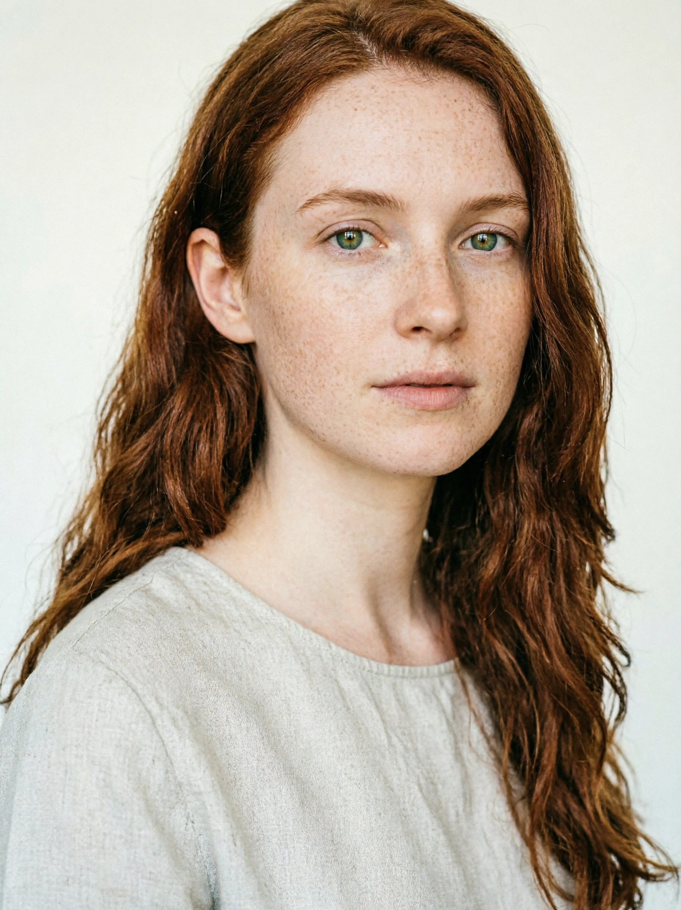
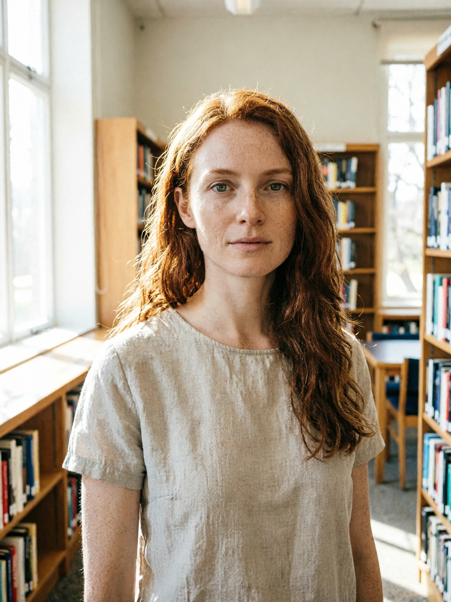
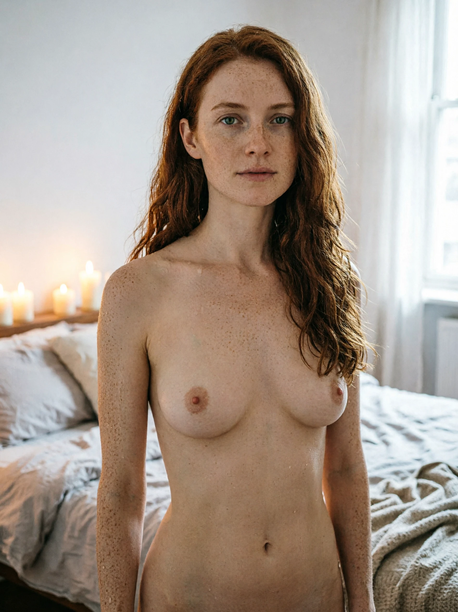
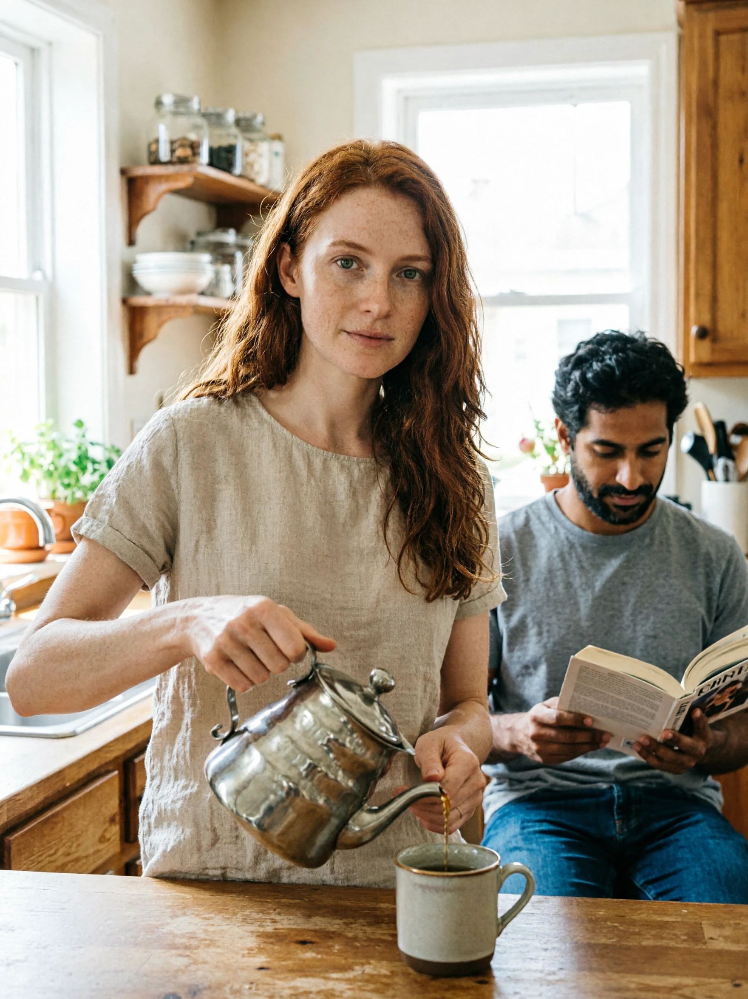
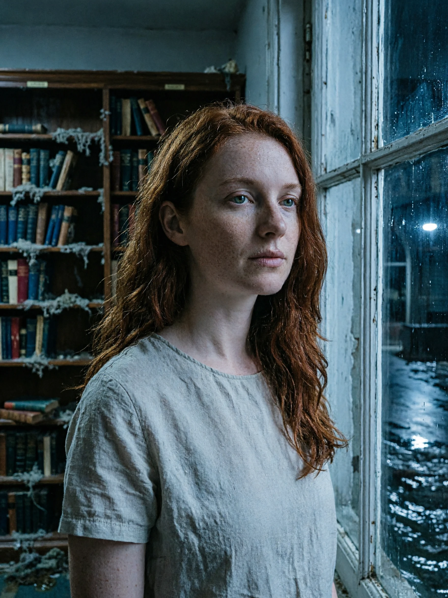
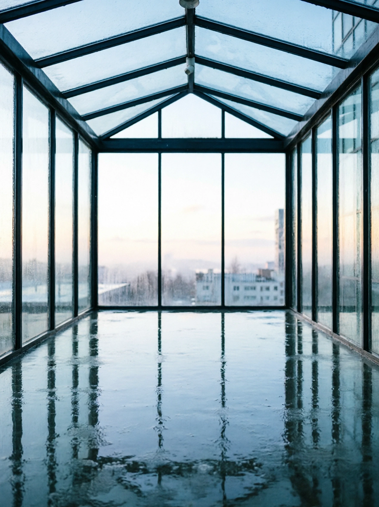

# Scene-image eval — manual review

Generated through the real scene flow against the live Venice models (`qwen-image-2` + `qwen-image-2-edit`).
A representative subset of `scripts/eval/scene-images/fixtures.ts`. Regenerate with `pnpm tsx scripts/eval/scene-images/render-subset.ts`.

## Identity portraits (qwen-image-2 text-to-image — reused as the edit anchor)

**Mira**

## Scenes

### 01-single-clothed-anchor.webp

- model: `qwen-image-2-edit` (edit of **Mira**'s portrait)
- prompt: Generate a new image of the exact same person shown in the reference image. Preserve face, hair color and style, skin tone, body proportions, and apparent age. First-person POV: the image is seen through the player's eyes. The player is the camera and must NEVER be visible — no body, no face, no hands in frame. Pose: standing naturally. Wearing: casual everyday clothing. Depict only the clothing described; add no garment that is not listed. Setting: a sunlit library. Lighting: soft natural light. Mood: quiet. High quality, no text, no watermark.

### 02-single-nude-anchor.webp

- model: `qwen-image-2-edit` (edit of **Mira**'s portrait)
- prompt: Generate a new image of the exact same person shown in the reference image. Preserve face, hair color and style, skin tone, body proportions, and apparent age. First-person POV: the image is seen through the player's eyes. The player is the camera and must NEVER be visible — no body, no face, no hands in frame. Pose: standing naturally. Fully nude, no clothing. Full breasts. Depict only the clothing described; add no garment that is not listed. Setting: a candlelit bedroom. Lighting: soft natural light. Mood: intimate. High quality, no text, no watermark.

### 03-two-clothed-one-anchor.webp

- model: `qwen-image-2-edit` (edit of **Mira**'s portrait)
- prompt: Generate a new image of the exact same person shown in the reference image. Preserve face, hair color and style, skin tone, body proportions, and apparent age. First-person POV: the image is seen through the player's eyes. The player is the camera and must NEVER be visible — no body, no face, no hands in frame. Pose: pouring tea. Wearing: casual everyday clothing. Also in frame: Sayed — wearing casual everyday clothing; reading. Depict only the clothing described; add no garment that is not listed. Setting: a warm kitchen. Lighting: soft natural light. Mood: calm. High quality, no text, no watermark.

### 04-character-plus-location.webp

- model: `qwen-image-2-edit` (edit of **Mira**'s portrait)
- prompt: Generate a new image of the exact same person shown in the reference image. Preserve face, hair color and style, skin tone, body proportions, and apparent age. First-person POV: the image is seen through the player's eyes. The player is the camera and must NEVER be visible — no body, no face, no hands in frame. Pose: gazing out a window. Wearing: casual everyday clothing. Depict only the clothing described; add no garment that is not listed. Setting: the Drowned Library — waterlogged shelves. Lighting: dim night-time lighting. Mood: melancholy. High quality, no text, no watermark.

### 05-location-only.webp

- model: `qwen-image-2` (text-to-image)
- prompt: First-person POV: the image is seen through the player's eyes. The player is the camera and must NEVER be visible — no body, no face, no hands in frame. No people in frame — a quiet shot of the place itself. Setting: an empty glass atrium in the rain. Lighting: pale dawn light. Mood: still. High quality, no text, no watermark.

